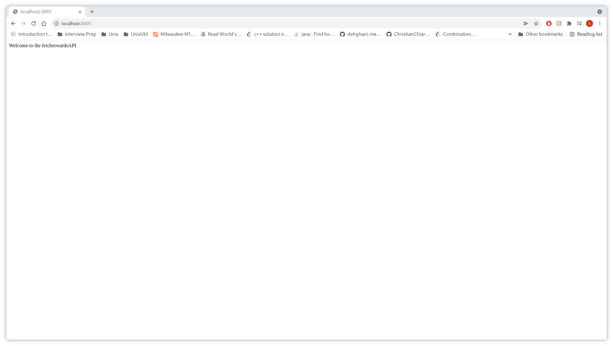
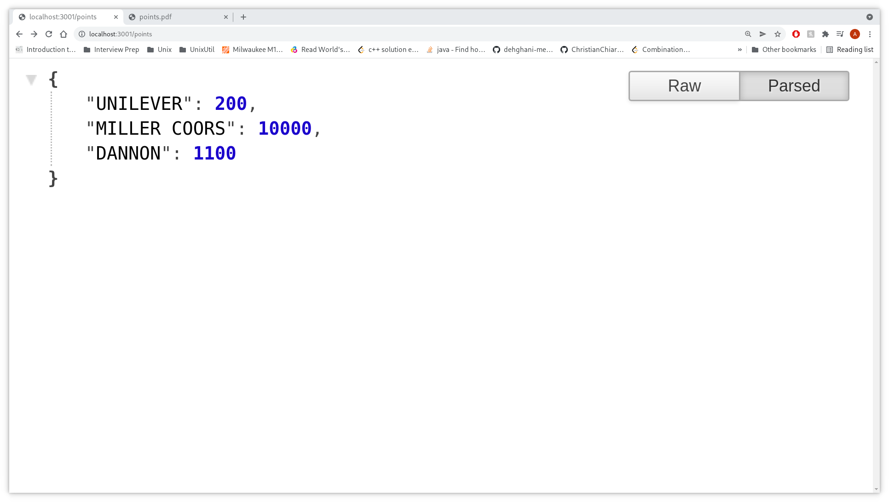
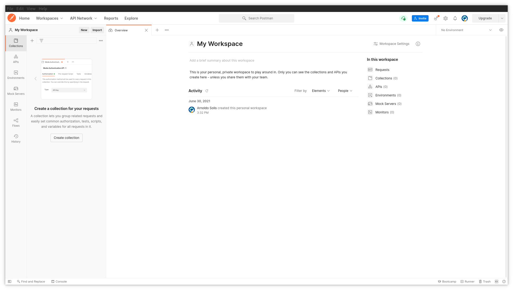
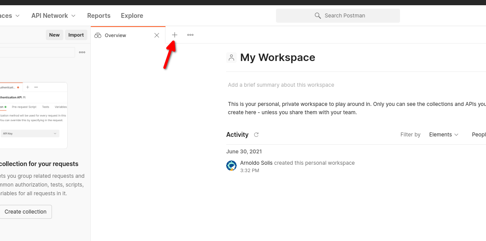
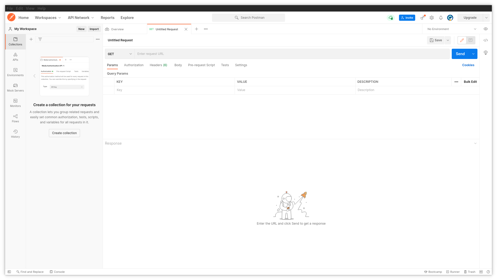
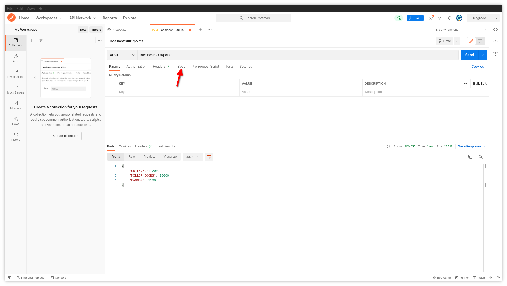
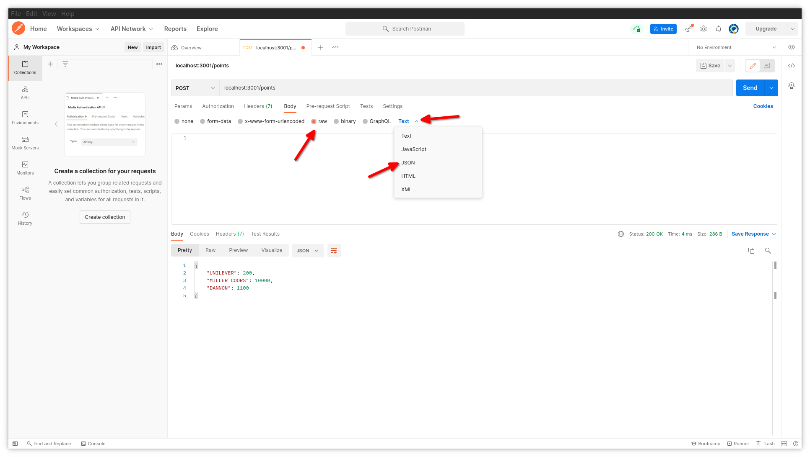
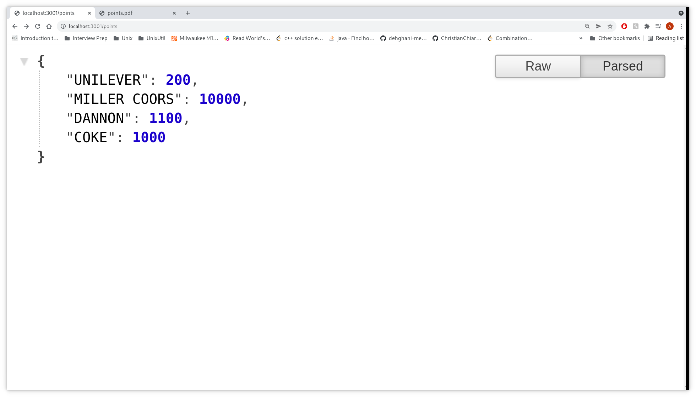
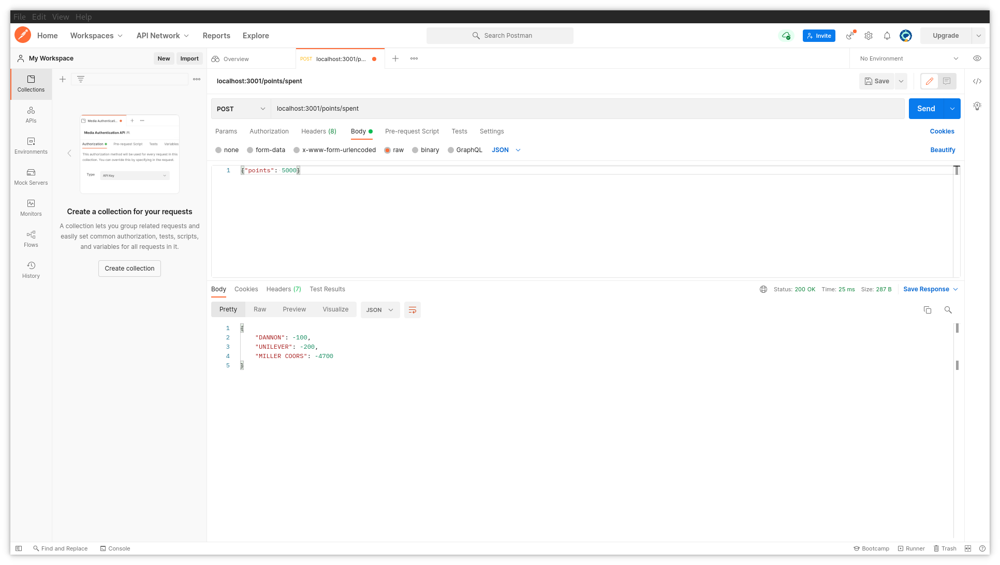
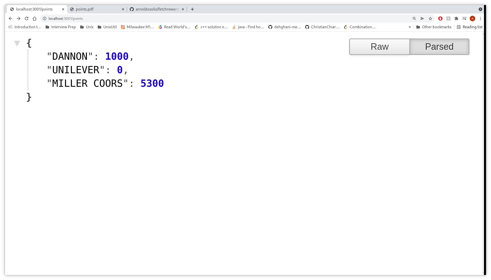

# fetchrewardsapi
###For for this exercise I used Node and its package express. For testing the routes I used postman.

### Things to install first:
First install Node(LTS version): 

https://nodejs.org/en/

Then you will want to download postman:

https://www.postman.com

You will be asked to sign up but you could just continue with your gmail account through the google sign in:

### Now to actuall run the project you must clone the repository:
1. You can do this by opening up your terminal or command prompt and doing:

git clone https://github.com/arnoldosolis/fetchrewardsapi.git

2. Then switch into the directory called fetchrewardsapi.

cd fetchrewardsapi 

3. Now you will want to install all node packages relating to web service which really just include express:

npm install

Then finally, run the service by typing in:

node server.js 

### Now we use postman to actuall test it
Before launching postman open up a browser of your choice and in the address bar go to:

http://localhost:3001

You will see the welcoming message to the fetchrewardsAPI:

Next to look and test the first route please navigate to: 

http://localhost:3001/points

If it looks visually different its because I have a chrome extension called json formatter installed.

For the following 2 routes we will need postman:

When you upen it up initally it will look like this.

You will want to press this button

You will then see this tab:

If you notice there a drop down where you see "GET" click that and select "POST".
Next to that you will see an empty field that says "Enter request URL". Here you will type: localhost:3001/points

Now we test the other route - the route where we can add transactions for a specific payer and date:
You must do so in json format and you must fill all fields else you will recieve an error saying you are missing a field. 

To send a data to the route you must navigate to the Body tab look below and click where the arrow is pointing to.

You will then see another row of options: click on raw and then you will see a new option to the far end of that row that says "Text". Click on it and Select JSON.

You can now send data to make your life easy you can copy paste the example from below directly into that text box and then in the top right corner click send:

Example:
{"payer": "COKE", "points": 1000, "timestamp": "2020-11-02T14:00:00Z" }

If we look back at our web browser you will notice that it works:

#### NOTE: You will also notice that we get the response we needed in postman.

Now to test our final route.
NOTE: I will be restarting my node server so that you see the output required from the problem naturally it will work regardless this is just for the purpose of demonstration.

You will want to append /spent at the end of localhost:3001/points
So in the address bar inside postman you should have:

localhost:3001/points/spent

Use this example given from the PDF:

Example: 
{ "points": 5000 }

Now you just click send in the top right corner. 

#### NOTE: You will also notice that we get the response we needed in postman.

Now to check if everything is up to date we can look at our browser one last time.

If you have any questions please don't hesitate to reach out to me @ arnoldosolis817@gmail.com
